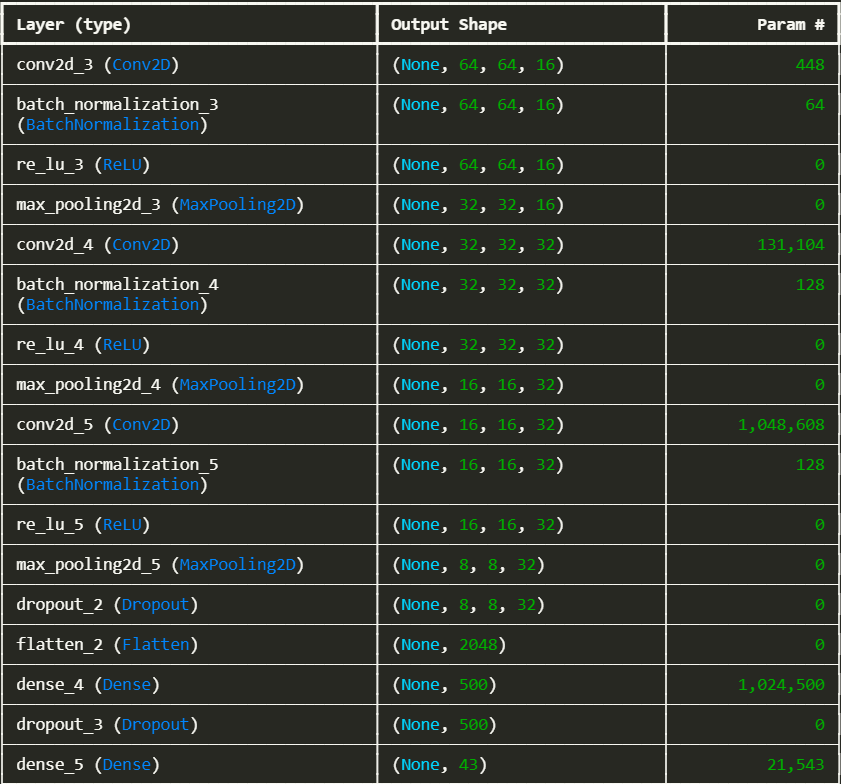
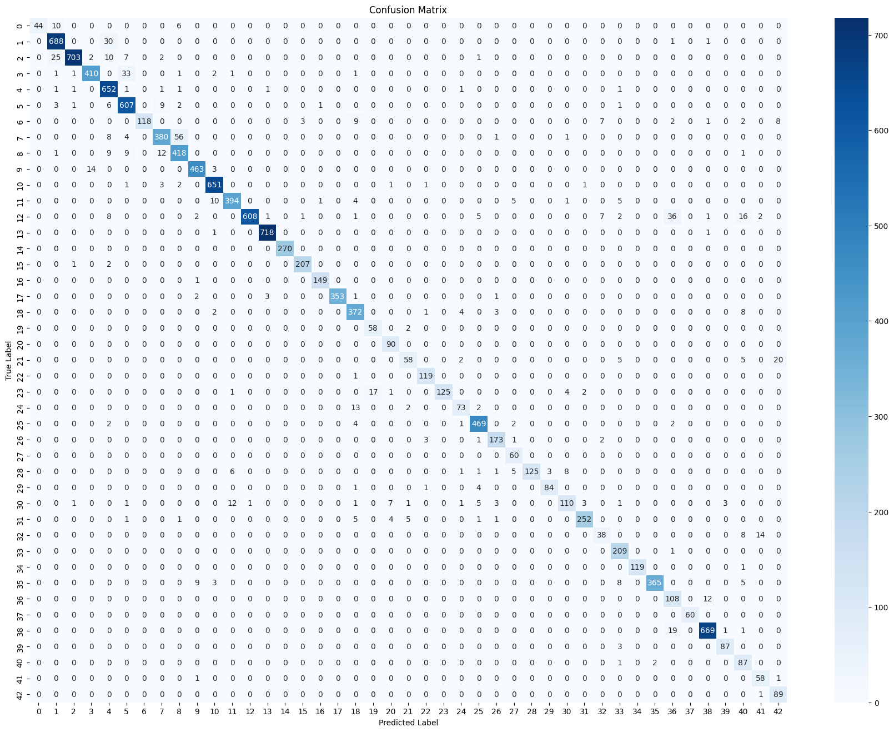
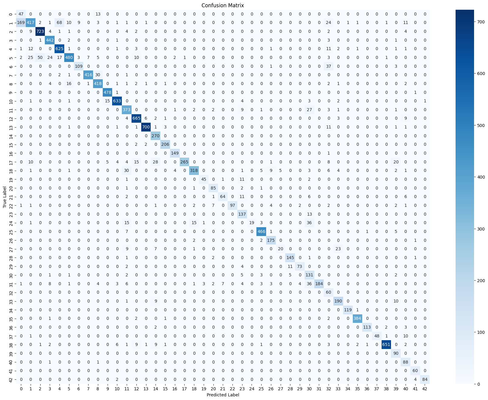

# Traffic-Sign-Classifier-On-GTSRB

This repository contains a traffic sign classification project using the GTSRB dataset. The goal of this project is to build a machine learning model that can accurately classify german traffic signs into their respective class.

## Table of Contents
- [Introduction](#introduction)
- [Dataset](#dataset)
- [Model Architecture](#model-architecture)
- [Fine-Tuning](#fine-tuning)
- [Results](#results)

## Introduction
Traffic sign classification is a popular application of machine learning. This project uses the GTSRB dataset, which is a well-known german traffic sign dataset, to train and evaluate a classifier that can predict the traffic signs.

## Dataset
The GTSRB dataset consists of more than 50000 images in total categorized into 43 classes. The dataset can be downloaded from [here](https://www.kaggle.com/datasets/meowmeowmeowmeowmeow/gtsrb-german-traffic-sign).

## Model Architecture
This file contains two models, One self-made and the other one a ResNet model which was fine-tuned and will be explained in Fine-Tuning section in details. 
The feature extraction part of this model consist of 3 convolution layers and 3 max pooling layers, Note that after each convolution layer we use a batch normalization layer to enhance the training process then we follow it up with a relu activation function to apply nonlinearity and then we apply max pooling.
In the Fully Connected part we simply add a FC layer after we've flatten our feature output and then we have an output layer that classifies the given image using softmax activation function.
Here you can see the structure of this model in detail:

## Fine-Tuning
The second model I used was the ResNet50 model which was fine-tuned on this dataset, similary to the first model, I've only added one FC layer after flatten the features and then give it to the same output layer.

## Results
The reuslt for the first model is about 94.14%. On the fine-tuned ResNet50 is 89.17%.
Here is an image of the confusion matrix for the first and secon model:

